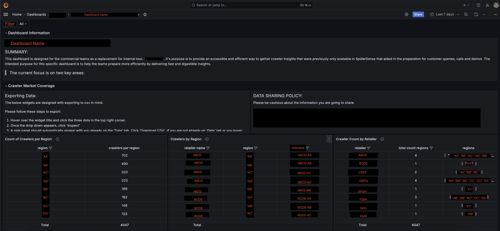
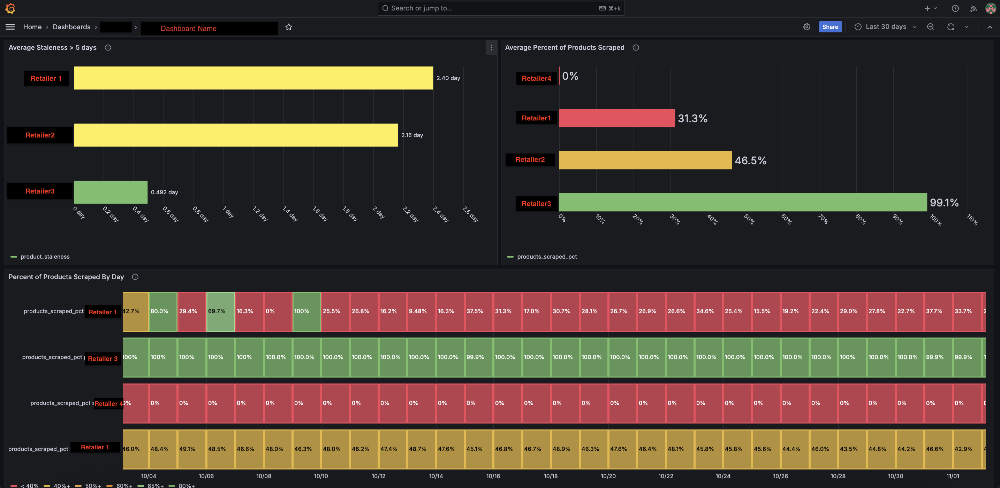

# Commercial-Team-Grafana-Dashboard
A real-time monitoring dashboard built to replace a deprecated internal tool used by the Commercial team (Customer Success, Sales, Analysts) to analyze and validate retailer coverage and crawler performance.

### Background:
This project began as a self-driven exploration of Grafana and evolved into a fully-owned initiative to provide internal teams with fast, reliable access to crawler and retail coverage insights.The dashboard delivers real-time visibility into product assortment coverage, data freshness, retailer counts, and regional tracking — supporting customer calls, demos, and strategic analysis.

### Business Objective:
Empower commercial teams with real-time crawler insight to quickly assess data freshness, coverage, and performance across 4,000+ crawlers, replacing a legacy internal tool and improving readiness for customer conversations and demos.

### Business Questions:
- Are we capturing the full product assortment?
- How fresh and complete is the crawler data that we are capturing?
- How many retailers are we currently tracking across the different markets?
- Which regions have the highest concentration of tracked retailers?
- How many geographic regions are we actively monitoring?

### Tech Stack:
- Grafana (visualization)
- ClickHouse (analytics database / data warehouse)
- SQL (CTEs, joins, aggregation, data modeling)

### Data Work:
- Explored ClickHouse tables to identify relevant data sources.
- Developed SQL queries with CTEs, joins, aggregates, and aliases to generate actionable metrics.
- Modeled raw data into retailer counts, data freshness, and regional coverage for Grafana dashboards.
- Validated outputs against business expectations and legacy tools.

### Result:
- Delivered a fully-functional dashboard adopted by Commercial teams
- Automated real-time insights for 4,000+ crawlers across global retailers
- Replaced deprecated internal monitoring tool
- Improved efficiency & visibility for customer-facing workflows
